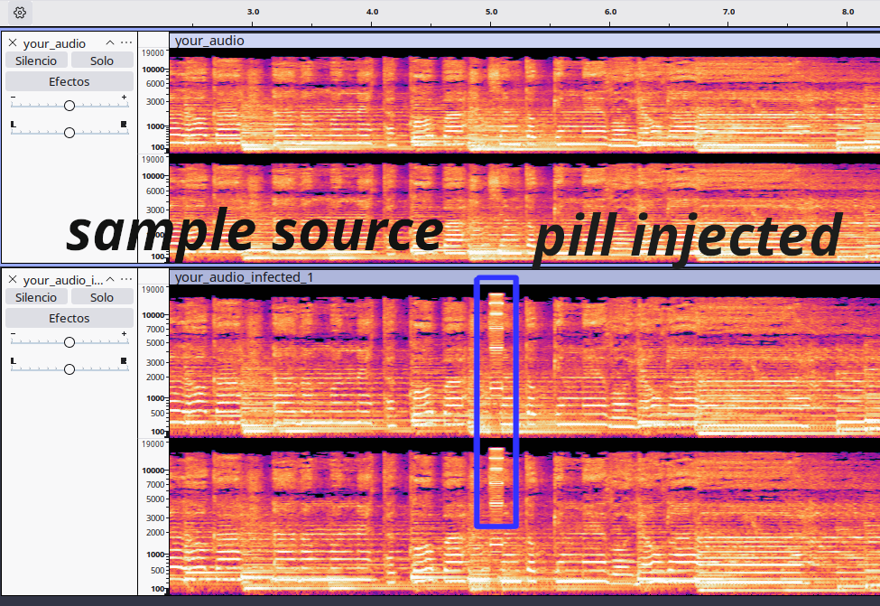

# Audio Pill Injector 💊🔊

<p align="center">
  
  
  
</p>

## 🧪 Proof of Concept

**This project is a Proof of Concept (PoC).** It's designed for experimentation and demonstration purposes. It might not be feature-complete, fully robust, or suitable for production environments.

<p align="center">
  
</p>

## 📝 Overview

`Audio Pill Infector` This serves as a conceptual exploration for a system that could help track the source of pre-release song leaks. For instance, if an artist shares slightly different "pilled" versions of an unreleased song with various parties, and one of those versions leaks, the unique pill within the leaked audio could help identify the source of the leak. The default "pill" used in this PoC is a high-frequency square wave, generally inaudible to humans.

## ✨ Features

*   🎶 **Generate Audio Pills:** Create a customizable audio "pill" (default: 25kHz square wave, 50ms duration).
*   🎧 **Overlay Pills:** Seamlessly overlay the generated pill onto a primary audio track.
*   ⚙️ **Simple CLI Usage:** Easy-to-use command-line interface for generating pills and processing audio.
*   📁 **Organized Structure:** Clear input and output directories for audio files.

## 📂 Project Structure

```
infect_audio/
├── generate_pill.py       # Script to generate the 'pill_standard.wav'
├── infect_audio.py        # Script to overlay the pill onto a base audio
├── pill_standard.wav      # The generated audio pill (default: 25kHz square wave)
├── input_audio/           # Place your target audio file here (e.g., your_song.mp3)
│   └── your_audio.mp3     # Example placeholder (you need to add your audio)
├── output_audio/          # Infected audio files will be saved here
│   └── your_audio_infected_1.mp3 # Example output
└── README.md              # This file
```

## 🛠️ Prerequisites

*   **Python 3.x**
*   **pydub:** A Python library for audio manipulation.
    ```bash
    pip install pydub
    ```
*   **ffmpeg:** `pydub` relies on `ffmpeg` (or `avconv`) for handling various audio formats, especially MP3s.
    ```bash
    # For Debian/Ubuntu-based systems
    sudo apt-get update && sudo apt-get install ffmpeg
    # For other systems, please refer to ffmpeg installation guides.
    ```

## 🚀 Usage

**0. Clone the Repository (If you haven't already):**
   ```bash
   git clone https://github.com/Flingocho/audio_pill_injection.git
   cd audio_pill_injection
   ```

1.  **Generate the Audio Pill (Optional - a default is provided)**:
    The `pill_standard.wav` is already included. If you want to regenerate it (e.g., after modifying `generate_pill.py`):
    ```bash
    # Navigate to the project directory
    cd path/to/your/infect_audio/
    python3 generate_pill.py
    ```
    This will create/overwrite `pill_standard.wav` in the `infect_audio` directory with a 25kHz square wave of 50ms duration.

2.  **Prepare Input Audio**:
    Place the audio file you want to "infect" into the `infect_audio/input_audio/` folder. For example, `infect_audio/input_audio/my_song.mp3`.
    *Note: The script currently expects only one file in this directory.*

3.  **Infect the Audio**:
    Navigate to the project's directory (e.g., `path/to/your/infect_audio/`) and run:
    ```bash
    python3 infect_audio.py
    ```
    This will process the audio file from `input_audio/`, overlay `pill_standard.wav`, and save the result in `output_audio/`. The output filename will be based on the input filename (e.g., `my_song_infected_1.mp3`).

    To generate multiple copies with the pill overlaid at slightly different increasing time offsets (1-second increments starting at 5 seconds):
    ```bash
    python3 infect_audio.py -n 5 
    ```
    This would create `my_song_infected_1.mp3`, `my_song_infected_2.mp3`, ..., `my_song_infected_5.mp3`.

## ⚙️ How It Works

*   **`generate_pill.py`**: This script creates a `.wav` file named `pill_standard.wav`. By default, it generates a 25kHz square wave lasting 50 milliseconds. This frequency is generally considered ultrasonic and inaudible to most humans. When examining the spectrogram of an audio file infected with this pill, the pill can often be clearly visualized as a distinct band at its specific frequency (see `images/example.png` for a visual representation).
*   **`infect_audio.py`**: This script takes the first audio file it finds in the `input_audio/` directory. It then overlays the `pill_standard.wav` onto this base audio. The overlay starts at an initial position (default: 5000ms) and can be repeated multiple times if `num_copies` is greater than 1, with each subsequent pill shifted forward in time (default: by 1000ms). The resulting audio file(s) are saved in the `output_audio/` directory.

## 💡 Future Ideas / Potential Improvements

*   More advanced pill generation options via CLI (waveform, frequency, duration, amplitude).
*   Configurable overlay positions, patterns, and randomness.
*   Batch processing of multiple files in the `input_audio` directory.
*   Option to specify input and output filenames/paths via CLI.
*   More robust error handling and file type checking.

## 📜 License

This project is licensed under the MIT License - see the `LICENSE` file for details (if one were present - for now, assume MIT).

---
Happy experimenting! 🔬

<div align="center">
  Created with ❤️ by <a href="https://github.com/Flingocho">Flingocho</a>
</div>
